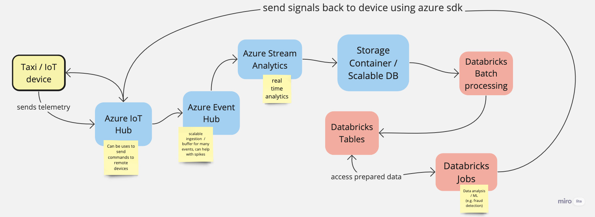

# Dataprocessing challenge

Solution to the data processing challenge 

1. Architecture



2. Data Ingestion, processing, testing, etc.

Data sources:

    - taxi data (Jan 2016) (https://www.nyc.gov/site/tlc/about/tlc-trip-record-data.page)
    - weather data (https://www.kaggle.com/datasets/selfishgene/historical-hourly-weather-data?rvi=1)

Setup: `pip install -U -r requirements.txt`

Run: `python main.py`

```
Field: ('congestion_surcharge', Null) does not match expected field: ('congestion_surcharge', Float64)
Field: ('airport_fee', Null) does not match expected field: ('airport_fee', Float64)
congestion_surcharge has 100.0% of null values
airport_fee has 100.0% of null values
1181413 rows of passenger_count either below 1 or above 3!
shape: (1_181_413, 23)
┌─────┬─────┬─────┬─────┬─────┬─────┬─────┬─────┬─────┬─────┬─────┬─────┬─────┬─────┬─────┬─────┬─────┬─────┬─────┬─────┬─────┬─────┬─────┐
│ Ven ┆ tpe ┆ tpe ┆ pas ┆ tri ┆ Rat ┆ sto ┆ PUL ┆ DOL ┆ pay ┆ far ┆ ext ┆ mta ┆ tip ┆ tol ┆ imp ┆ tot ┆ con ┆ air ┆ yea ┆ mon ┆ day ┆ hou │
│ dor ┆ p_p ┆ p_d ┆ sen ┆ p_d ┆ eco ┆ re_ ┆ oca ┆ oca ┆ men ┆ e_a ┆ ra  ┆ _ta ┆ _am ┆ ls_ ┆ rov ┆ al_ ┆ ges ┆ por ┆ r   ┆ th  ┆ --- ┆ r   │
│ ID  ┆ ick ┆ rop ┆ ger ┆ ist ┆ deI ┆ and ┆ tio ┆ tio ┆ t_t ┆ mou ┆ --- ┆ x   ┆ oun ┆ amo ┆ eme ┆ amo ┆ tio ┆ t_f ┆ --- ┆ --- ┆ u32 ┆ --- │
│ --- ┆ up_ ┆ off ┆ _co ┆ anc ┆ D   ┆ _fw ┆ nID ┆ nID ┆ ype ┆ nt  ┆ f64 ┆ --- ┆ t   ┆ unt ┆ nt_ ┆ unt ┆ n_s ┆ ee  ┆ i32 ┆ u32 ┆     ┆ u32 │
│ i64 ┆ dat ┆ _da ┆ unt ┆ e   ┆ --- ┆ d_f ┆ --- ┆ --- ┆ --- ┆ --- ┆     ┆ f64 ┆ --- ┆ --- ┆ sur ┆ --- ┆ urc ┆ --- ┆     ┆     ┆     ┆     │
│     ┆ eti ┆ tet ┆ --- ┆ --- ┆ i64 ┆ lag ┆ i64 ┆ i64 ┆ i64 ┆ f64 ┆     ┆     ┆ f64 ┆ f64 ┆ cha ┆ f64 ┆ har ┆ nul ┆     ┆     ┆     ┆     │
│     ┆ me  ┆ ime ┆ i64 ┆ f64 ┆     ┆ --- ┆     ┆     ┆     ┆     ┆     ┆     ┆     ┆     ┆ rge ┆     ┆ ge  ┆ l   ┆     ┆     ┆     ┆     │
│     ┆ --- ┆ --- ┆     ┆     ┆     ┆ str ┆     ┆     ┆     ┆     ┆     ┆     ┆     ┆     ┆ --- ┆     ┆ --- ┆     ┆     ┆     ┆     ┆     │
│     ┆ dat ┆ dat ┆     ┆     ┆     ┆     ┆     ┆     ┆     ┆     ┆     ┆     ┆     ┆     ┆ f64 ┆     ┆ nul ┆     ┆     ┆     ┆     ┆     │
│     ┆ eti ┆ eti ┆     ┆     ┆     ┆     ┆     ┆     ┆     ┆     ┆     ┆     ┆     ┆     ┆     ┆     ┆ l   ┆     ┆     ┆     ┆     ┆     │
│     ┆ me[ ┆ me[ ┆     ┆     ┆     ┆     ┆     ┆     ┆     ┆     ┆     ┆     ┆     ┆     ┆     ┆     ┆     ┆     ┆     ┆     ┆     ┆     │
│     ┆ ns] ┆ ns] ┆     ┆     ┆     ┆     ┆     ┆     ┆     ┆     ┆     ┆     ┆     ┆     ┆     ┆     ┆     ┆     ┆     ┆     ┆     ┆     │
╞═════╪═════╪═════╪═════╪═════╪═════╪═════╪═════╪═════╪═════╪═════╪═════╪═════╪═════╪═════╪═════╪═════╪═════╪═════╪═════╪═════╪═════╪═════╡
│ 2   ┆ 201 ┆ 201 ┆ 5   ┆ 3.4 ┆ 1   ┆ N   ┆ 48  ┆ 79  ┆ 2   ┆ 20. ┆ 0.5 ┆ 0.5 ┆ 0.0 ┆ 0.0 ┆ 0.3 ┆ 21. ┆ nul ┆ nul ┆ 201 ┆ 1   ┆ 1   ┆ 0   │
│     ┆ 6-0 ┆ 6-0 ┆     ┆ 6   ┆     ┆     ┆     ┆     ┆     ┆ 0   ┆     ┆     ┆     ┆     ┆     ┆ 3   ┆ l   ┆ l   ┆ 6   ┆     ┆     ┆     │
│     ┆ 1-0 ┆ 1-0 ┆     ┆     ┆     ┆     ┆     ┆     ┆     ┆     ┆     ┆     ┆     ┆     ┆     ┆     ┆     ┆     ┆     ┆     ┆     ┆     │
│     ┆ 1   ┆ 1   ┆     ┆     ┆     ┆     ┆     ┆     ┆     ┆     ┆     ┆     ┆     ┆     ┆     ┆     ┆     ┆     ┆     ┆     ┆     ┆     │
│     ┆ 00: ┆ 00: ┆     ┆     ┆     ┆     ┆     ┆     ┆     ┆     ┆     ┆     ┆     ┆     ┆     ┆     ┆     ┆     ┆     ┆     ┆     ┆     │
│     ┆ 25: ┆ 55: ┆     ┆     ┆     ┆     ┆     ┆     ┆     ┆     ┆     ┆     ┆     ┆     ┆     ┆     ┆     ┆     ┆     ┆     ┆     ┆     │
│     ┆ 28  ┆ 46  ┆     ┆     ┆     ┆     ┆     ┆     ┆     ┆     ┆     ┆     ┆     ┆     ┆     ┆     ┆     ┆     ┆     ┆     ┆     ┆     │
│ 2   ┆ 201 ┆ 201 ┆ 4   ┆ 0.8 ┆ 1   ┆ N   ┆ 79  ┆ 107 ┆ 2   ┆ 5.5 ┆ 0.5 ┆ 0.5 ┆ 0.0 ┆ 0.0 ┆ 0.3 ┆ 6.8 ┆ nul ┆ nul ┆ 201 ┆ 1   ┆ 1   ┆ 0   │
│     ┆ 6-0 ┆ 6-0 ┆     ┆ 3   ┆     ┆     ┆     ┆     ┆     ┆     ┆     ┆     ┆     ┆     ┆     ┆     ┆ l   ┆ l   ┆ 6   ┆     ┆     ┆     │
│     ┆ 1-0 ┆ 1-0 ┆     ┆     ┆     ┆     ┆     ┆     ┆     ┆     ┆     ┆     ┆     ┆     ┆     ┆     ┆     ┆     ┆     ┆     ┆     ┆     │
│     ┆ 1   ┆ 1   ┆     ┆     ┆     ┆     ┆     ┆     ┆     ┆     ┆     ┆     ┆     ┆     ┆     ┆     ┆     ┆     ┆     ┆     ┆     ┆     │
│     ┆ 00: ┆ 01: ┆     ┆     ┆     ┆     ┆     ┆     ┆     ┆     ┆     ┆     ┆     ┆     ┆     ┆     ┆     ┆     ┆     ┆     ┆     ┆     │
│     ┆ 56: ┆ 02: ┆     ┆     ┆     ┆     ┆     ┆     ┆     ┆     ┆     ┆     ┆     ┆     ┆     ┆     ┆     ┆     ┆     ┆     ┆     ┆     │
│     ┆ 57  ┆ 24  ┆     ┆     ┆     ┆     ┆     ┆     ┆     ┆     ┆     ┆     ┆     ┆     ┆     ┆     ┆     ┆     ┆     ┆     ┆     ┆     │
│ 1   ┆ 201 ┆ 201 ┆ 4   ┆ 0.6 ┆ 1   ┆ N   ┆ 162 ┆ 237 ┆ 2   ┆ 5.0 ┆ 0.5 ┆ 0.5 ┆ 0.0 ┆ 0.0 ┆ 0.3 ┆ 6.3 ┆ nul ┆ nul ┆ 201 ┆ 1   ┆ 1   ┆ 0   │
│     ┆ 6-0 ┆ 6-0 ┆     ┆     ┆     ┆     ┆     ┆     ┆     ┆     ┆     ┆     ┆     ┆     ┆     ┆     ┆ l   ┆ l   ┆ 6   ┆     ┆     ┆     │
│     ┆ 1-0 ┆ 1-0 ┆     ┆     ┆     ┆     ┆     ┆     ┆     ┆     ┆     ┆     ┆     ┆     ┆     ┆     ┆     ┆     ┆     ┆     ┆     ┆     │
│     ┆ 1   ┆ 1   ┆     ┆     ┆     ┆     ┆     ┆     ┆     ┆     ┆     ┆     ┆     ┆     ┆     ┆     ┆     ┆     ┆     ┆     ┆     ┆     │
│     ┆ 00: ┆ 01: ┆     ┆     ┆     ┆     ┆     ┆     ┆     ┆     ┆     ┆     ┆     ┆     ┆     ┆     ┆     ┆     ┆     ┆     ┆     ┆     │
│     ┆ 55: ┆ 00: ┆     ┆     ┆     ┆     ┆     ┆     ┆     ┆     ┆     ┆     ┆     ┆     ┆     ┆     ┆     ┆     ┆     ┆     ┆     ┆     │
│     ┆ 36  ┆ 26  ┆     ┆     ┆     ┆     ┆     ┆     ┆     ┆     ┆     ┆     ┆     ┆     ┆     ┆     ┆     ┆     ┆     ┆     ┆     ┆     │
│ 2   ┆ 201 ┆ 201 ┆ 5   ┆ 0.7 ┆ 1   ┆ N   ┆ 158 ┆ 249 ┆ 2   ┆ 6.0 ┆ 0.5 ┆ 0.5 ┆ 0.0 ┆ 0.0 ┆ 0.3 ┆ 7.3 ┆ nul ┆ nul ┆ 201 ┆ 1   ┆ 1   ┆ 0   │
│     ┆ 6-0 ┆ 6-0 ┆     ┆ 3   ┆     ┆     ┆     ┆     ┆     ┆     ┆     ┆     ┆     ┆     ┆     ┆     ┆ l   ┆ l   ┆ 6   ┆     ┆     ┆     │
│     ┆ 1-0 ┆ 1-0 ┆     ┆     ┆     ┆     ┆     ┆     ┆     ┆     ┆     ┆     ┆     ┆     ┆     ┆     ┆     ┆     ┆     ┆     ┆     ┆     │
│     ┆ 1   ┆ 1   ┆     ┆     ┆     ┆     ┆     ┆     ┆     ┆     ┆     ┆     ┆     ┆     ┆     ┆     ┆     ┆     ┆     ┆     ┆     ┆     │
│     ┆ 00: ┆ 00: ┆     ┆     ┆     ┆     ┆     ┆     ┆     ┆     ┆     ┆     ┆     ┆     ┆     ┆     ┆     ┆     ┆     ┆     ┆     ┆     │
│     ┆ 05: ┆ 13: ┆     ┆     ┆     ┆     ┆     ┆     ┆     ┆     ┆     ┆     ┆     ┆     ┆     ┆     ┆     ┆     ┆     ┆     ┆     ┆     │
│     ┆ 22  ┆ 28  ┆     ┆     ┆     ┆     ┆     ┆     ┆     ┆     ┆     ┆     ┆     ┆     ┆     ┆     ┆     ┆     ┆     ┆     ┆     ┆     │
│ …   ┆ …   ┆ …   ┆ …   ┆ …   ┆ …   ┆ …   ┆ …   ┆ …   ┆ …   ┆ …   ┆ …   ┆ …   ┆ …   ┆ …   ┆ …   ┆ …   ┆ …   ┆ …   ┆ …   ┆ …   ┆ …   ┆ …   │
│ 2   ┆ 201 ┆ 201 ┆ 5   ┆ 0.9 ┆ 1   ┆ N   ┆ 142 ┆ 163 ┆ 2   ┆ 5.5 ┆ 0.5 ┆ 0.5 ┆ 0.0 ┆ 0.0 ┆ 0.3 ┆ 6.8 ┆ nul ┆ nul ┆ 201 ┆ 1   ┆ 31  ┆ 23  │
│     ┆ 6-0 ┆ 6-0 ┆     ┆ 7   ┆     ┆     ┆     ┆     ┆     ┆     ┆     ┆     ┆     ┆     ┆     ┆     ┆ l   ┆ l   ┆ 6   ┆     ┆     ┆     │
│     ┆ 1-3 ┆ 1-3 ┆     ┆     ┆     ┆     ┆     ┆     ┆     ┆     ┆     ┆     ┆     ┆     ┆     ┆     ┆     ┆     ┆     ┆     ┆     ┆     │
│     ┆ 1   ┆ 1   ┆     ┆     ┆     ┆     ┆     ┆     ┆     ┆     ┆     ┆     ┆     ┆     ┆     ┆     ┆     ┆     ┆     ┆     ┆     ┆     │
│     ┆ 23: ┆ 23: ┆     ┆     ┆     ┆     ┆     ┆     ┆     ┆     ┆     ┆     ┆     ┆     ┆     ┆     ┆     ┆     ┆     ┆     ┆     ┆     │
│     ┆ 07: ┆ 12: ┆     ┆     ┆     ┆     ┆     ┆     ┆     ┆     ┆     ┆     ┆     ┆     ┆     ┆     ┆     ┆     ┆     ┆     ┆     ┆     │
│     ┆ 50  ┆ 25  ┆     ┆     ┆     ┆     ┆     ┆     ┆     ┆     ┆     ┆     ┆     ┆     ┆     ┆     ┆     ┆     ┆     ┆     ┆     ┆     │
│ 2   ┆ 201 ┆ 201 ┆ 5   ┆ 1.1 ┆ 1   ┆ N   ┆ 146 ┆ 7   ┆ 1   ┆ 7.0 ┆ 0.5 ┆ 0.5 ┆ 1.6 ┆ 0.0 ┆ 0.3 ┆ 9.9 ┆ nul ┆ nul ┆ 201 ┆ 1   ┆ 31  ┆ 23  │
│     ┆ 6-0 ┆ 6-0 ┆     ┆ 7   ┆     ┆     ┆     ┆     ┆     ┆     ┆     ┆     ┆ 6   ┆     ┆     ┆ 6   ┆ l   ┆ l   ┆ 6   ┆     ┆     ┆     │
│     ┆ 1-3 ┆ 1-3 ┆     ┆     ┆     ┆     ┆     ┆     ┆     ┆     ┆     ┆     ┆     ┆     ┆     ┆     ┆     ┆     ┆     ┆     ┆     ┆     │
│     ┆ 1   ┆ 1   ┆     ┆     ┆     ┆     ┆     ┆     ┆     ┆     ┆     ┆     ┆     ┆     ┆     ┆     ┆     ┆     ┆     ┆     ┆     ┆     │
│     ┆ 23: ┆ 23: ┆     ┆     ┆     ┆     ┆     ┆     ┆     ┆     ┆     ┆     ┆     ┆     ┆     ┆     ┆     ┆     ┆     ┆     ┆     ┆     │
│     ┆ 21: ┆ 28: ┆     ┆     ┆     ┆     ┆     ┆     ┆     ┆     ┆     ┆     ┆     ┆     ┆     ┆     ┆     ┆     ┆     ┆     ┆     ┆     │
│     ┆ 47  ┆ 36  ┆     ┆     ┆     ┆     ┆     ┆     ┆     ┆     ┆     ┆     ┆     ┆     ┆     ┆     ┆     ┆     ┆     ┆     ┆     ┆     │
│ 2   ┆ 201 ┆ 201 ┆ 6   ┆ 4.8 ┆ 1   ┆ N   ┆ 249 ┆ 236 ┆ 2   ┆ 15. ┆ 0.5 ┆ 0.5 ┆ 0.0 ┆ 0.0 ┆ 0.3 ┆ 16. ┆ nul ┆ nul ┆ 201 ┆ 1   ┆ 31  ┆ 23  │
│     ┆ 6-0 ┆ 6-0 ┆     ┆ 8   ┆     ┆     ┆     ┆     ┆     ┆ 5   ┆     ┆     ┆     ┆     ┆     ┆ 8   ┆ l   ┆ l   ┆ 6   ┆     ┆     ┆     │
│     ┆ 1-3 ┆ 1-3 ┆     ┆     ┆     ┆     ┆     ┆     ┆     ┆     ┆     ┆     ┆     ┆     ┆     ┆     ┆     ┆     ┆     ┆     ┆     ┆     │
│     ┆ 1   ┆ 1   ┆     ┆     ┆     ┆     ┆     ┆     ┆     ┆     ┆     ┆     ┆     ┆     ┆     ┆     ┆     ┆     ┆     ┆     ┆     ┆     │
│     ┆ 23: ┆ 23: ┆     ┆     ┆     ┆     ┆     ┆     ┆     ┆     ┆     ┆     ┆     ┆     ┆     ┆     ┆     ┆     ┆     ┆     ┆     ┆     │
│     ┆ 31: ┆ 44: ┆     ┆     ┆     ┆     ┆     ┆     ┆     ┆     ┆     ┆     ┆     ┆     ┆     ┆     ┆     ┆     ┆     ┆     ┆     ┆     │
│     ┆ 09  ┆ 33  ┆     ┆     ┆     ┆     ┆     ┆     ┆     ┆     ┆     ┆     ┆     ┆     ┆     ┆     ┆     ┆     ┆     ┆     ┆     ┆     │
│ 2   ┆ 201 ┆ 201 ┆ 5   ┆ 5.6 ┆ 1   ┆ N   ┆ 74  ┆ 212 ┆ 2   ┆ 18. ┆ 0.5 ┆ 0.5 ┆ 0.0 ┆ 0.0 ┆ 0.3 ┆ 19. ┆ nul ┆ nul ┆ 201 ┆ 1   ┆ 31  ┆ 23  │
│     ┆ 6-0 ┆ 6-0 ┆     ┆ 3   ┆     ┆     ┆     ┆     ┆     ┆ 5   ┆     ┆     ┆     ┆     ┆     ┆ 8   ┆ l   ┆ l   ┆ 6   ┆     ┆     ┆     │
│     ┆ 1-3 ┆ 1-3 ┆     ┆     ┆     ┆     ┆     ┆     ┆     ┆     ┆     ┆     ┆     ┆     ┆     ┆     ┆     ┆     ┆     ┆     ┆     ┆     │
│     ┆ 1   ┆ 1   ┆     ┆     ┆     ┆     ┆     ┆     ┆     ┆     ┆     ┆     ┆     ┆     ┆     ┆     ┆     ┆     ┆     ┆     ┆     ┆     │
│     ┆ 23: ┆ 23: ┆     ┆     ┆     ┆     ┆     ┆     ┆     ┆     ┆     ┆     ┆     ┆     ┆     ┆     ┆     ┆     ┆     ┆     ┆     ┆     │
│     ┆ 39: ┆ 54: ┆     ┆     ┆     ┆     ┆     ┆     ┆     ┆     ┆     ┆     ┆     ┆     ┆     ┆     ┆     ┆     ┆     ┆     ┆     ┆     │
│     ┆ 18  ┆ 14  ┆     ┆     ┆     ┆     ┆     ┆     ┆     ┆     ┆     ┆     ┆     ┆     ┆     ┆     ┆     ┆     ┆     ┆     ┆     ┆     │
└─────┴─────┴─────┴─────┴─────┴─────┴─────┴─────┴─────┴─────┴─────┴─────┴─────┴─────┴─────┴─────┴─────┴─────┴─────┴─────┴─────┴─────┴─────┘
422 had positive fare amounts but no passengers
shape: (422, 23)
┌─────┬─────┬─────┬─────┬─────┬─────┬─────┬─────┬─────┬─────┬─────┬─────┬─────┬─────┬─────┬─────┬─────┬─────┬─────┬─────┬─────┬─────┬─────┐
│ Ven ┆ tpe ┆ tpe ┆ pas ┆ tri ┆ Rat ┆ sto ┆ PUL ┆ DOL ┆ pay ┆ far ┆ ext ┆ mta ┆ tip ┆ tol ┆ imp ┆ tot ┆ con ┆ air ┆ yea ┆ mon ┆ day ┆ hou │
│ dor ┆ p_p ┆ p_d ┆ sen ┆ p_d ┆ eco ┆ re_ ┆ oca ┆ oca ┆ men ┆ e_a ┆ ra  ┆ _ta ┆ _am ┆ ls_ ┆ rov ┆ al_ ┆ ges ┆ por ┆ r   ┆ th  ┆ --- ┆ r   │
│ ID  ┆ ick ┆ rop ┆ ger ┆ ist ┆ deI ┆ and ┆ tio ┆ tio ┆ t_t ┆ mou ┆ --- ┆ x   ┆ oun ┆ amo ┆ eme ┆ amo ┆ tio ┆ t_f ┆ --- ┆ --- ┆ u32 ┆ --- │
│ --- ┆ up_ ┆ off ┆ _co ┆ anc ┆ D   ┆ _fw ┆ nID ┆ nID ┆ ype ┆ nt  ┆ f64 ┆ --- ┆ t   ┆ unt ┆ nt_ ┆ unt ┆ n_s ┆ ee  ┆ i32 ┆ u32 ┆     ┆ u32 │
│ i64 ┆ dat ┆ _da ┆ unt ┆ e   ┆ --- ┆ d_f ┆ --- ┆ --- ┆ --- ┆ --- ┆     ┆ f64 ┆ --- ┆ --- ┆ sur ┆ --- ┆ urc ┆ --- ┆     ┆     ┆     ┆     │
│     ┆ eti ┆ tet ┆ --- ┆ --- ┆ i64 ┆ lag ┆ i64 ┆ i64 ┆ i64 ┆ f64 ┆     ┆     ┆ f64 ┆ f64 ┆ cha ┆ f64 ┆ har ┆ nul ┆     ┆     ┆     ┆     │
│     ┆ me  ┆ ime ┆ i64 ┆ f64 ┆     ┆ --- ┆     ┆     ┆     ┆     ┆     ┆     ┆     ┆     ┆ rge ┆     ┆ ge  ┆ l   ┆     ┆     ┆     ┆     │
│     ┆ --- ┆ --- ┆     ┆     ┆     ┆ str ┆     ┆     ┆     ┆     ┆     ┆     ┆     ┆     ┆ --- ┆     ┆ --- ┆     ┆     ┆     ┆     ┆     │
│     ┆ dat ┆ dat ┆     ┆     ┆     ┆     ┆     ┆     ┆     ┆     ┆     ┆     ┆     ┆     ┆ f64 ┆     ┆ nul ┆     ┆     ┆     ┆     ┆     │
│     ┆ eti ┆ eti ┆     ┆     ┆     ┆     ┆     ┆     ┆     ┆     ┆     ┆     ┆     ┆     ┆     ┆     ┆ l   ┆     ┆     ┆     ┆     ┆     │
│     ┆ me[ ┆ me[ ┆     ┆     ┆     ┆     ┆     ┆     ┆     ┆     ┆     ┆     ┆     ┆     ┆     ┆     ┆     ┆     ┆     ┆     ┆     ┆     │
│     ┆ ns] ┆ ns] ┆     ┆     ┆     ┆     ┆     ┆     ┆     ┆     ┆     ┆     ┆     ┆     ┆     ┆     ┆     ┆     ┆     ┆     ┆     ┆     │
╞═════╪═════╪═════╪═════╪═════╪═════╪═════╪═════╪═════╪═════╪═════╪═════╪═════╪═════╪═════╪═════╪═════╪═════╪═════╪═════╪═════╪═════╪═════╡
│ 1   ┆ 201 ┆ 201 ┆ 0   ┆ 0.0 ┆ 5   ┆ N   ┆ 42  ┆ 42  ┆ 1   ┆ 10. ┆ 0.0 ┆ 0.0 ┆ 0.0 ┆ 0.0 ┆ 0.3 ┆ 10. ┆ nul ┆ nul ┆ 201 ┆ 1   ┆ 1   ┆ 0   │
│     ┆ 6-0 ┆ 6-0 ┆     ┆     ┆     ┆     ┆     ┆     ┆     ┆ 0   ┆     ┆     ┆     ┆     ┆     ┆ 3   ┆ l   ┆ l   ┆ 6   ┆     ┆     ┆     │
│     ┆ 1-0 ┆ 1-0 ┆     ┆     ┆     ┆     ┆     ┆     ┆     ┆     ┆     ┆     ┆     ┆     ┆     ┆     ┆     ┆     ┆     ┆     ┆     ┆     │
│     ┆ 1   ┆ 1   ┆     ┆     ┆     ┆     ┆     ┆     ┆     ┆     ┆     ┆     ┆     ┆     ┆     ┆     ┆     ┆     ┆     ┆     ┆     ┆     │
│     ┆ 00: ┆ 00: ┆     ┆     ┆     ┆     ┆     ┆     ┆     ┆     ┆     ┆     ┆     ┆     ┆     ┆     ┆     ┆     ┆     ┆     ┆     ┆     │
│     ┆ 06: ┆ 06: ┆     ┆     ┆     ┆     ┆     ┆     ┆     ┆     ┆     ┆     ┆     ┆     ┆     ┆     ┆     ┆     ┆     ┆     ┆     ┆     │
│     ┆ 21  ┆ 54  ┆     ┆     ┆     ┆     ┆     ┆     ┆     ┆     ┆     ┆     ┆     ┆     ┆     ┆     ┆     ┆     ┆     ┆     ┆     ┆     │
│ 2   ┆ 201 ┆ 201 ┆ 0   ┆ 0.0 ┆ 5   ┆ N   ┆ 75  ┆ 75  ┆ 2   ┆ 20. ┆ 0.0 ┆ 0.5 ┆ 0.0 ┆ 0.0 ┆ 0.3 ┆ 21. ┆ nul ┆ nul ┆ 201 ┆ 1   ┆ 1   ┆ 2   │
│     ┆ 6-0 ┆ 6-0 ┆     ┆     ┆     ┆     ┆     ┆     ┆     ┆ 5   ┆     ┆     ┆     ┆     ┆     ┆ 3   ┆ l   ┆ l   ┆ 6   ┆     ┆     ┆     │
│     ┆ 1-0 ┆ 1-0 ┆     ┆     ┆     ┆     ┆     ┆     ┆     ┆     ┆     ┆     ┆     ┆     ┆     ┆     ┆     ┆     ┆     ┆     ┆     ┆     │
│     ┆ 1   ┆ 1   ┆     ┆     ┆     ┆     ┆     ┆     ┆     ┆     ┆     ┆     ┆     ┆     ┆     ┆     ┆     ┆     ┆     ┆     ┆     ┆     │
│     ┆ 02: ┆ 02: ┆     ┆     ┆     ┆     ┆     ┆     ┆     ┆     ┆     ┆     ┆     ┆     ┆     ┆     ┆     ┆     ┆     ┆     ┆     ┆     │
│     ┆ 55: ┆ 55: ┆     ┆     ┆     ┆     ┆     ┆     ┆     ┆     ┆     ┆     ┆     ┆     ┆     ┆     ┆     ┆     ┆     ┆     ┆     ┆     │
│     ┆ 49  ┆ 54  ┆     ┆     ┆     ┆     ┆     ┆     ┆     ┆     ┆     ┆     ┆     ┆     ┆     ┆     ┆     ┆     ┆     ┆     ┆     ┆     │
│ 2   ┆ 201 ┆ 201 ┆ 0   ┆ 0.0 ┆ 5   ┆ N   ┆ 48  ┆ 48  ┆ 1   ┆ 15. ┆ 0.0 ┆ 0.5 ┆ 0.0 ┆ 0.0 ┆ 0.3 ┆ 15. ┆ nul ┆ nul ┆ 201 ┆ 1   ┆ 1   ┆ 2   │
│     ┆ 6-0 ┆ 6-0 ┆     ┆     ┆     ┆     ┆     ┆     ┆     ┆ 0   ┆     ┆     ┆     ┆     ┆     ┆ 8   ┆ l   ┆ l   ┆ 6   ┆     ┆     ┆     │
│     ┆ 1-0 ┆ 1-0 ┆     ┆     ┆     ┆     ┆     ┆     ┆     ┆     ┆     ┆     ┆     ┆     ┆     ┆     ┆     ┆     ┆     ┆     ┆     ┆     │
│     ┆ 1   ┆ 1   ┆     ┆     ┆     ┆     ┆     ┆     ┆     ┆     ┆     ┆     ┆     ┆     ┆     ┆     ┆     ┆     ┆     ┆     ┆     ┆     │
│     ┆ 02: ┆ 02: ┆     ┆     ┆     ┆     ┆     ┆     ┆     ┆     ┆     ┆     ┆     ┆     ┆     ┆     ┆     ┆     ┆     ┆     ┆     ┆     │
│     ┆ 12: ┆ 12: ┆     ┆     ┆     ┆     ┆     ┆     ┆     ┆     ┆     ┆     ┆     ┆     ┆     ┆     ┆     ┆     ┆     ┆     ┆     ┆     │
│     ┆ 23  ┆ 27  ┆     ┆     ┆     ┆     ┆     ┆     ┆     ┆     ┆     ┆     ┆     ┆     ┆     ┆     ┆     ┆     ┆     ┆     ┆     ┆     │
│ 2   ┆ 201 ┆ 201 ┆ 0   ┆ 0.0 ┆ 5   ┆ N   ┆ 61  ┆ 61  ┆ 1   ┆ 10. ┆ 0.0 ┆ 0.5 ┆ 4.0 ┆ 0.0 ┆ 0.3 ┆ 14. ┆ nul ┆ nul ┆ 201 ┆ 1   ┆ 1   ┆ 3   │
│     ┆ 6-0 ┆ 6-0 ┆     ┆     ┆     ┆     ┆     ┆     ┆     ┆ 0   ┆     ┆     ┆     ┆     ┆     ┆ 8   ┆ l   ┆ l   ┆ 6   ┆     ┆     ┆     │
│     ┆ 1-0 ┆ 1-0 ┆     ┆     ┆     ┆     ┆     ┆     ┆     ┆     ┆     ┆     ┆     ┆     ┆     ┆     ┆     ┆     ┆     ┆     ┆     ┆     │
│     ┆ 1   ┆ 1   ┆     ┆     ┆     ┆     ┆     ┆     ┆     ┆     ┆     ┆     ┆     ┆     ┆     ┆     ┆     ┆     ┆     ┆     ┆     ┆     │
│     ┆ 03: ┆ 03: ┆     ┆     ┆     ┆     ┆     ┆     ┆     ┆     ┆     ┆     ┆     ┆     ┆     ┆     ┆     ┆     ┆     ┆     ┆     ┆     │
│     ┆ 23: ┆ 23: ┆     ┆     ┆     ┆     ┆     ┆     ┆     ┆     ┆     ┆     ┆     ┆     ┆     ┆     ┆     ┆     ┆     ┆     ┆     ┆     │
│     ┆ 22  ┆ 42  ┆     ┆     ┆     ┆     ┆     ┆     ┆     ┆     ┆     ┆     ┆     ┆     ┆     ┆     ┆     ┆     ┆     ┆     ┆     ┆     │
│ …   ┆ …   ┆ …   ┆ …   ┆ …   ┆ …   ┆ …   ┆ …   ┆ …   ┆ …   ┆ …   ┆ …   ┆ …   ┆ …   ┆ …   ┆ …   ┆ …   ┆ …   ┆ …   ┆ …   ┆ …   ┆ …   ┆ …   │
│ 1   ┆ 201 ┆ 201 ┆ 0   ┆ 0.9 ┆ 5   ┆ N   ┆ 142 ┆ 142 ┆ 1   ┆ 59. ┆ 0.0 ┆ 0.0 ┆ 3.0 ┆ 0.0 ┆ 0.3 ┆ 62. ┆ nul ┆ nul ┆ 201 ┆ 1   ┆ 31  ┆ 17  │
│     ┆ 6-0 ┆ 6-0 ┆     ┆     ┆     ┆     ┆     ┆     ┆     ┆ 0   ┆     ┆     ┆     ┆     ┆     ┆ 3   ┆ l   ┆ l   ┆ 6   ┆     ┆     ┆     │
│     ┆ 1-3 ┆ 1-3 ┆     ┆     ┆     ┆     ┆     ┆     ┆     ┆     ┆     ┆     ┆     ┆     ┆     ┆     ┆     ┆     ┆     ┆     ┆     ┆     │
│     ┆ 1   ┆ 1   ┆     ┆     ┆     ┆     ┆     ┆     ┆     ┆     ┆     ┆     ┆     ┆     ┆     ┆     ┆     ┆     ┆     ┆     ┆     ┆     │
│     ┆ 17: ┆ 17: ┆     ┆     ┆     ┆     ┆     ┆     ┆     ┆     ┆     ┆     ┆     ┆     ┆     ┆     ┆     ┆     ┆     ┆     ┆     ┆     │
│     ┆ 08: ┆ 08: ┆     ┆     ┆     ┆     ┆     ┆     ┆     ┆     ┆     ┆     ┆     ┆     ┆     ┆     ┆     ┆     ┆     ┆     ┆     ┆     │
│     ┆ 14  ┆ 26  ┆     ┆     ┆     ┆     ┆     ┆     ┆     ┆     ┆     ┆     ┆     ┆     ┆     ┆     ┆     ┆     ┆     ┆     ┆     ┆     │
│ 2   ┆ 201 ┆ 201 ┆ 0   ┆ 0.0 ┆ 5   ┆ N   ┆ 138 ┆ 138 ┆ 2   ┆ 43. ┆ 0.0 ┆ 0.5 ┆ 0.0 ┆ 0.0 ┆ 0.3 ┆ 44. ┆ nul ┆ nul ┆ 201 ┆ 1   ┆ 31  ┆ 18  │
│     ┆ 6-0 ┆ 6-0 ┆     ┆     ┆     ┆     ┆     ┆     ┆     ┆ 5   ┆     ┆     ┆     ┆     ┆     ┆ 3   ┆ l   ┆ l   ┆ 6   ┆     ┆     ┆     │
│     ┆ 1-3 ┆ 1-3 ┆     ┆     ┆     ┆     ┆     ┆     ┆     ┆     ┆     ┆     ┆     ┆     ┆     ┆     ┆     ┆     ┆     ┆     ┆     ┆     │
│     ┆ 1   ┆ 1   ┆     ┆     ┆     ┆     ┆     ┆     ┆     ┆     ┆     ┆     ┆     ┆     ┆     ┆     ┆     ┆     ┆     ┆     ┆     ┆     │
│     ┆ 18: ┆ 18: ┆     ┆     ┆     ┆     ┆     ┆     ┆     ┆     ┆     ┆     ┆     ┆     ┆     ┆     ┆     ┆     ┆     ┆     ┆     ┆     │
│     ┆ 29: ┆ 29: ┆     ┆     ┆     ┆     ┆     ┆     ┆     ┆     ┆     ┆     ┆     ┆     ┆     ┆     ┆     ┆     ┆     ┆     ┆     ┆     │
│     ┆ 12  ┆ 16  ┆     ┆     ┆     ┆     ┆     ┆     ┆     ┆     ┆     ┆     ┆     ┆     ┆     ┆     ┆     ┆     ┆     ┆     ┆     ┆     │
│ 1   ┆ 201 ┆ 201 ┆ 0   ┆ 22. ┆ 5   ┆ N   ┆ 13  ┆ 132 ┆ 1   ┆ 52. ┆ 0.0 ┆ 0.0 ┆ 10. ┆ 0.0 ┆ 0.3 ┆ 62. ┆ nul ┆ nul ┆ 201 ┆ 1   ┆ 31  ┆ 20  │
│     ┆ 6-0 ┆ 6-0 ┆     ┆ 1   ┆     ┆     ┆     ┆     ┆     ┆ 0   ┆     ┆     ┆ 45  ┆     ┆     ┆ 75  ┆ l   ┆ l   ┆ 6   ┆     ┆     ┆     │
│     ┆ 1-3 ┆ 1-3 ┆     ┆     ┆     ┆     ┆     ┆     ┆     ┆     ┆     ┆     ┆     ┆     ┆     ┆     ┆     ┆     ┆     ┆     ┆     ┆     │
│     ┆ 1   ┆ 1   ┆     ┆     ┆     ┆     ┆     ┆     ┆     ┆     ┆     ┆     ┆     ┆     ┆     ┆     ┆     ┆     ┆     ┆     ┆     ┆     │
│     ┆ 20: ┆ 21: ┆     ┆     ┆     ┆     ┆     ┆     ┆     ┆     ┆     ┆     ┆     ┆     ┆     ┆     ┆     ┆     ┆     ┆     ┆     ┆     │
│     ┆ 45: ┆ 39: ┆     ┆     ┆     ┆     ┆     ┆     ┆     ┆     ┆     ┆     ┆     ┆     ┆     ┆     ┆     ┆     ┆     ┆     ┆     ┆     │
│     ┆ 33  ┆ 39  ┆     ┆     ┆     ┆     ┆     ┆     ┆     ┆     ┆     ┆     ┆     ┆     ┆     ┆     ┆     ┆     ┆     ┆     ┆     ┆     │
│ 1   ┆ 201 ┆ 201 ┆ 0   ┆ 17. ┆ 5   ┆ N   ┆ 161 ┆ 161 ┆ 1   ┆ 58. ┆ 0.0 ┆ 0.0 ┆ 11. ┆ 0.0 ┆ 0.3 ┆ 69. ┆ nul ┆ nul ┆ 201 ┆ 1   ┆ 31  ┆ 23  │
│     ┆ 6-0 ┆ 6-0 ┆     ┆ 1   ┆     ┆     ┆     ┆     ┆     ┆ 0   ┆     ┆     ┆ 65  ┆     ┆     ┆ 95  ┆ l   ┆ l   ┆ 6   ┆     ┆     ┆     │
│     ┆ 1-3 ┆ 1-3 ┆     ┆     ┆     ┆     ┆     ┆     ┆     ┆     ┆     ┆     ┆     ┆     ┆     ┆     ┆     ┆     ┆     ┆     ┆     ┆     │
│     ┆ 1   ┆ 1   ┆     ┆     ┆     ┆     ┆     ┆     ┆     ┆     ┆     ┆     ┆     ┆     ┆     ┆     ┆     ┆     ┆     ┆     ┆     ┆     │
│     ┆ 23: ┆ 23: ┆     ┆     ┆     ┆     ┆     ┆     ┆     ┆     ┆     ┆     ┆     ┆     ┆     ┆     ┆     ┆     ┆     ┆     ┆     ┆     │
│     ┆ 39: ┆ 39: ┆     ┆     ┆     ┆     ┆     ┆     ┆     ┆     ┆     ┆     ┆     ┆     ┆     ┆     ┆     ┆     ┆     ┆     ┆     ┆     │
│     ┆ 22  ┆ 25  ┆     ┆     ┆     ┆     ┆     ┆     ┆     ┆     ┆     ┆     ┆     ┆     ┆     ┆     ┆     ┆     ┆     ┆     ┆     ┆     │
└─────┴─────┴─────┴─────┴─────┴─────┴─────┴─────┴─────┴─────┴─────┴─────┴─────┴─────┴─────┴─────┴─────┴─────┴─────┴─────┴─────┴─────┴─────┘
humidity has 3.59% of null values
pressure has 2.3% of null values
temperature has 1.75% of null values
wind_speed has 1.75% of null values
Writing file output/taxi_data_final.parquet
Shape of final data: (10905067, 28)
```